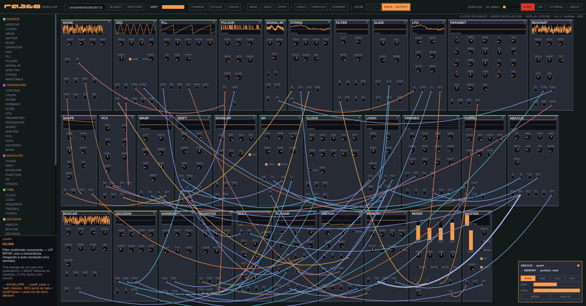

# Rasgo Modular

**Website:** [lucioaraujo.github.io/rasgo-modular](https://lucioaraujo.github.io/rasgo-modular/) ·
**Download:** [v0.1.5 release](https://github.com/lucioaraujo/rasgo-modular/releases/tag/v0.1.5) ·
**Contact:** **rasgo.instruments@gmail.com**

Languages:

- [English](#english)
- [Português](#português)
- [Français](#français)
- [Español](#español)

---

## English

**Patches as a starting point.** Rasgo Modular opens with a patch already
built and sounding. You can play it as it is, turn the controls, rewire it by
hand, or take it all apart and start from scratch. Every patch comes from a
number, the seed, and the same number always brings back the same sound.

**Authorship:** Lúcio Araújo · **Family:** [RASGO](https://rasgoinstruments.arquiviagem.net/) ·
**Version:** v0.1.5 · **License:** GNU AGPL-3.0-or-later (see [`LICENSE`](LICENSE)
and [`CREDITS_AND_SOURCES.md`](CREDITS_AND_SOURCES.md))

### What it is

A modular synthesizer is an instrument made of separate modules, each with one
job: one makes sound, another filters it, another keeps time, another makes
decisions. You connect outputs to inputs with cables, and the sound comes out
of those connections. Rasgo Modular does this on the computer screen, with
**58 modules** in eight families (SOURCE, TRANSFORM, MODULATE, TIME, DECISION,
ROUTE, SPACE, OUT).

It is a standalone program: it opens, sounds and records, with no other music
software needed. MIDI and audio input come in through an optional module, and
the app only opens the audio input after you switch that module ON.

Under the hood it is C++17 with no dependencies in the core. Each module is
described as data, including its panel in millimetres, and the same engine
drives a cross-platform JUCE app and an X11 test panel.

### The cables play too

Every cable has settings of its own, which open when you click on it:

- **Conduction:** a cable can let the signal through only part of the time,
  at random.
- **Relation:** a cable can combine what it carries with a second signal of
  your choice, by multiplying (RING), folding (FOLD) or subtracting (DIFF).
- **Rupture:** a broken cable keeps repeating the last stretch it carried,
  quieter each time, instead of cutting to silence.

### How you use it

**From a seed.** Press SEED and the app builds a new patch. Listen, turn the
controls, rewire a few cables. VARY moves the controls slowly while you play;
CHANGE, EVOLVE and CROSS take the patch down new paths from where it is.

**From scratch.** Press `n` to remove every cable. The modules stay in the
rack and the sound stops; from then on every connection is yours. `Ctrl+Z`
undoes the last action, one cable at a time.

To learn as you play, hover over any module, control or jack: the LEARN box
explains it in English, Portuguese, French or Spanish. The
[module guide](https://lucioaraujo.github.io/rasgo-modular/modulos-en.html) explains all 58 modules for beginners, with an
exercise for each one.

The REC button records a 24-bit `.wav` plus a `.score.txt` that logs the
patch at the start of the take and every gesture made during it. Patches are
saved as `.rmp` files.

### Download

[**v0.1.5 release**](https://github.com/lucioaraujo/rasgo-modular/releases/tag/v0.1.5) —
Linux `.deb`, AppImage and `.tar.gz`, Windows `.exe` and portable `.zip`,
macOS `.dmg`, all built and packaged by continuous integration.

| Platform | Built | Run | Audio verified |
|---|---|---|---|
| Linux x86-64 | yes | yes | yes, on real hardware |
| Windows x86-64 | continuous integration | yes, by the author (Windows 10, 8 GB) | yes, by the author |
| macOS (Universal 2) | continuous integration | yes, by the author (6 Oct. 2026, after allowing it — see INSTALL) | yes, by the author |

**Minimum:** Windows 10 (1607+) or 11, 64-bit · macOS 10.15+ (Intel or Apple Silicon) · Linux x86-64 with glibc 2.35+ (Ubuntu 22.04+, Debian 12+, Mint 21+) · a 64-bit processor with two cores or more · ~55 MB of memory · a 1280 × 760 screen. Details in [`INSTALL.md`](INSTALL.md).

Said in full before you download: v0.1.5 was installed by the author on
the same Windows 10 machine on 7 Oct. 2026, and its CI now also checks that
the Start menu shortcut points to the installed program (in v0.1.4 and
earlier it did not open anything). It has not been tried on a real Mac yet.
For v0.1.4, the Windows package was installed and
played by the author on a real Windows 10 machine (8 GB) on 6 Oct. 2026;
the macOS package was opened and played by the author on a real Mac on the same day,
after allowing it (see INSTALL). The `.dmg` is ad-hoc signed, without
Developer ID or notarisation — so macOS blocks it on first launch until you
allow it once.

**On first launch, Windows and macOS show a security warning.** It is
expected and does not mean anything is wrong. What to click on each system:
[INSTALL.md → Installing, step by step](INSTALL.md#installing-step-by-step).

### Build from source

Requirements, build steps, environment variables and troubleshooting are
in [`INSTALL.md`](INSTALL.md) (English and Portuguese). With JUCE available,
`./run` builds when needed and opens the app. What changed between versions
is in [`CHANGELOG.md`](CHANGELOG.md); development notes, in Portuguese, are
in [`DESENVOLVIMENTO.md`](DESENVOLVIMENTO.md).

---

## Português

**Patches como ponto de partida.** O Rasgo Modular abre com um patch já
montado e soando. Você pode tocá-lo como está, mexer nos controles, refazer os
cabos à mão ou desmontar tudo e começar do zero. Cada patch nasce de um
número, a semente, e o mesmo número traz sempre o mesmo som.

**Autoria:** Lúcio Araújo · **Família:** [RASGO](https://rasgoinstruments.arquiviagem.net/) ·
**Versão:** v0.1.5 · **Licença:** GNU AGPL-3.0-or-later (ver [`LICENSE`](LICENSE)
e [`CREDITS_AND_SOURCES.md`](CREDITS_AND_SOURCES.md))

### O que é

Um sintetizador modular é um instrumento feito de módulos independentes, cada
um com uma função: um gera som, outro filtra, outro marca o tempo, outro toma
decisões. Você liga saídas a entradas com cabos, e o som nasce dessas
ligações. O Rasgo Modular faz isso na tela do computador, com **58 módulos**
em oito famílias (SOURCE, TRANSFORM, MODULATE, TIME, DECISION, ROUTE, SPACE,
OUT).

É um programa que funciona sozinho: abre, soa e grava, sem precisar de outro
software de música. MIDI e entrada de áudio chegam por um módulo opcional, e o
app só abre a entrada de áudio depois que você liga o ON desse módulo.

Por dentro, é C++17 sem dependências no núcleo. Cada módulo é descrito por
dados, inclusive o painel em milímetros, e o mesmo motor alimenta um app
multiplataforma em JUCE e um painel de teste em X11.

### Os cabos também tocam

Cada cabo tem ajustes próprios, que aparecem quando você clica nele:

- **Condução:** o cabo pode deixar o sinal passar só parte do tempo, ao
  acaso.
- **Relação:** o cabo pode combinar o que leva com um segundo sinal, à sua
  escolha, multiplicando (RING), dobrando (FOLD) ou subtraindo (DIFF).
- **Ruptura:** um cabo rompido continua repetindo o último trecho que levava,
  cada vez mais baixo, em vez de cortar para o silêncio.

### Como se usa

**A partir de uma semente.** Aperte SEED e o app monta um patch novo. Ouça,
mexa nos controles, refaça alguns cabos. VARIA move os controles devagar
enquanto você toca; MUDA, EVOLUI e CRUZA levam o patch para outros caminhos a
partir do atual.

**Do zero.** Aperte `n` para tirar todos os cabos. Os módulos ficam no rack e
o som para; daí em diante, cada ligação é sua. `Ctrl+Z` desfaz a última ação,
cabo por cabo.

Para aprender enquanto toca, passe o mouse sobre qualquer módulo, controle ou
entrada: a caixa LEARN explica em português, inglês, francês ou espanhol. O
[guia dos módulos](https://lucioaraujo.github.io/rasgo-modular/modulos.html) explica os 58 módulos para quem está começando,
com um exercício para cada um.

O botão REC grava um `.wav` de 24 bits e um `.score.txt` que anota o patch no
início da gravação e cada gesto feito durante ela. Os patches são salvos em
arquivos `.rmp`.

### Download

[**Release v0.1.5**](https://github.com/lucioaraujo/rasgo-modular/releases/tag/v0.1.5) —
Linux `.deb`, AppImage e `.tar.gz`; Windows `.exe` e `.zip` portátil; macOS
`.dmg` — todos construídos e empacotados pela integração contínua.

| Plataforma | Construído | Executado | Áudio verificado |
|---|---|---|---|
| Linux x86-64 | sim | sim | sim, em hardware real |
| Windows x86-64 | na integração contínua | sim, pelo autor (Windows 10, 8 GB) | sim, pelo autor |
| macOS (Universal 2) | na integração contínua | sim, pelo autor (6 out. 2026, depois de liberar — ver INSTALL) | sim, pelo autor |

**Mínimo:** Windows 10 (1607+) ou 11, 64 bits · macOS 10.15+ (Intel ou Apple Silicon) · Linux x86-64 com glibc 2.35+ (Ubuntu 22.04+, Debian 12+, Mint 21+) · processador de 64 bits com dois núcleos ou mais · ~55 MB de memória · tela de 1280 × 760. Detalhes no [`INSTALL.md`](INSTALL.md).

Dito por inteiro antes de baixar: a v0.1.5 foi instalada pelo autor no
mesmo Windows 10 em 7 out. 2026, e a CI agora também confere que o atalho
do Menu Iniciar aponta para o programa instalado (até a v0.1.4 ele não
abria nada). Ela ainda não foi testada num Mac real. Na v0.1.4, o pacote de
Windows foi instalado e tocado
pelo autor num Windows 10 real (8 GB) em 6 out. 2026, e o de macOS foi
aberto e tocado pelo autor num Mac real no mesmo dia, depois de liberado (ver
INSTALL). O `.dmg` tem assinatura ad-hoc, sem Developer ID nem notarização:
na primeira abertura o macOS bloqueia o app até você liberá-lo uma vez.

**Na primeira abertura, o Windows e o macOS mostram um aviso de
segurança.** É esperado e não indica defeito. O que clicar em cada sistema
está em [INSTALL.md → Instalar, passo a passo](INSTALL.md#instalar-passo-a-passo).

### Compilar a partir do código

Requisitos, passos de build, variáveis de ambiente e problemas comuns estão
no [`INSTALL.md`](INSTALL.md) (português e inglês). Com o JUCE disponível,
`./run` compila quando precisa e abre o app. O que mudou entre versões está
no [`CHANGELOG.md`](CHANGELOG.md); as notas de desenvolvimento, no
[`DESENVOLVIMENTO.md`](DESENVOLVIMENTO.md).

---

## Français

**Des patchs comme point de départ.** Rasgo Modular s'ouvre sur un patch
déjà monté qui sonne. Vous pouvez le jouer tel quel, tourner les réglages,
refaire les câbles à la main, ou tout démonter et repartir de zéro. Chaque
patch naît d'un nombre, la graine, et le même nombre redonne toujours le même
son.

**Auteur :** Lúcio Araújo · **Famille :** [RASGO](https://rasgoinstruments.arquiviagem.net/) ·
**Version :** v0.1.5 · **Licence :** GNU AGPL-3.0-or-later (voir [`LICENSE`](LICENSE)
et [`CREDITS_AND_SOURCES.md`](CREDITS_AND_SOURCES.md))

### Ce que c'est

Un synthétiseur modulaire est un instrument fait de modules indépendants,
chacun avec une fonction : l'un produit du son, un autre le filtre, un autre
bat la mesure, un autre prend des décisions. Vous reliez des sorties à des
entrées avec des câbles, et le son naît de ces liaisons. Rasgo Modular fait
cela sur l'écran de l'ordinateur, avec **58 modules** en huit familles
(SOURCE, TRANSFORM, MODULATE, TIME, DECISION, ROUTE, SPACE, OUT).

C'est un programme autonome : il s'ouvre, sonne et enregistre, sans autre
logiciel de musique. Le MIDI et l'entrée audio passent par un module
optionnel, et l'application n'ouvre l'entrée audio qu'après que vous avez allumé le ON de ce module.

Sous le capot, c'est du C++17 sans dépendances dans le noyau. Chaque module
est décrit par des données, y compris son panneau en millimètres, et le même
moteur fait tourner une application JUCE multiplateforme et un panneau de test
X11.

### Les câbles jouent aussi

Chaque câble a ses propres réglages, qui apparaissent quand vous cliquez
dessus :

- **Conduction :** un câble peut ne laisser passer le signal qu'une partie du
  temps, au hasard.
- **Relation :** un câble peut combiner ce qu'il porte avec un second signal
  de votre choix, en multipliant (RING), en repliant (FOLD) ou en soustrayant
  (DIFF).
- **Rupture :** un câble rompu continue de répéter le dernier passage qu'il
  portait, de plus en plus bas, au lieu de couper net.

### Comment s'en servir

**À partir d'une graine.** Appuyez sur SEED et l'application monte un nouveau
patch. Écoutez, tournez les réglages, refaites quelques câbles. VARIER fait
bouger les réglages lentement pendant que vous jouez ; CHANGER, ÉVOLUE et
CROISER emmènent le patch sur d'autres chemins à partir de l'actuel.

**À partir de zéro.** Appuyez sur `n` pour retirer tous les câbles. Les
modules restent dans le rack et le son s'arrête ; dès lors, chaque liaison
vous appartient. `Ctrl+Z` annule la dernière action, câble par câble.

Pour apprendre en jouant, survolez n'importe quel module, réglage ou prise :
la boîte LEARN l'explique en français, portugais, anglais ou espagnol. Le
[guide des modules](https://lucioaraujo.github.io/rasgo-modular/modulos-fr.html) explique les 58 modules pour qui débute, avec un
exercice pour chacun.

Le bouton REC enregistre un `.wav` en 24 bits et un `.score.txt` qui note le
patch au début de la prise et chaque geste fait pendant celle-ci. Les patchs
sont enregistrés dans des fichiers `.rmp`.

### Téléchargement

[**Version v0.1.5**](https://github.com/lucioaraujo/rasgo-modular/releases/tag/v0.1.5) —
`.deb` pour Linux, `.exe` pour Windows, `.dmg` pour macOS, tous construits et
empaquetés par l'intégration continue.

| Plateforme | Construit | Lancé | Audio vérifié |
|---|---|---|---|
| Linux x86-64 | oui | oui | oui, sur matériel réel |
| Windows x86-64 | intégration continue | oui, par l'auteur (Windows 10, 8 Go) | oui, par l'auteur |
| macOS (Universal 2) | intégration continue | oui, par l'auteur (6 oct. 2026, après l'avoir autorisé — voir INSTALL) | oui, par l'auteur |

**Minimum :** Windows 10 (1607+) ou 11, 64 bits · macOS 10.15+ (Intel ou Apple Silicon) · Linux x86-64 avec glibc 2.35+ (Ubuntu 22.04+, Debian 12+, Mint 21+) · processeur 64 bits à deux cœurs ou plus · ~55 Mo de mémoire · écran de 1280 × 760. Détails dans [`INSTALL.md`](INSTALL.md).

Dit en entier avant de télécharger : la v0.1.5 a été installée par l'auteur
sur le même Windows 10 le 7 oct. 2026, et la CI vérifie désormais aussi que
le raccourci du menu Démarrer pointe vers le programme installé (jusqu'à la
v0.1.4, il n'ouvrait rien). Elle n'a pas encore été essayée sur un vrai Mac.
Pour la v0.1.4, le paquet Windows a été installé et
joué par l'auteur sur une vraie machine Windows 10 (8 Go) le 6 oct. 2026,
et celui de macOS a été ouvert et joué par l'auteur sur un vrai Mac le même jour,
après l'avoir autorisé (voir INSTALL). Le `.dmg` est signé en ad-hoc, sans
Developer ID ni notarisation : au premier lancement, macOS le bloque jusqu'à
ce que vous l'autorisiez une fois.

**Au premier lancement, Windows et macOS affichent un avertissement de
sécurité.** C'est attendu et ne signale aucun défaut. Où cliquer sur chaque
système : [INSTALL.md → Installing, step by step](INSTALL.md#installing-step-by-step)
(en anglais et en portugais).

### Compiler depuis les sources

Prérequis, étapes de compilation, variables d'environnement et problèmes
courants sont dans [`INSTALL.md`](INSTALL.md) (en anglais et en portugais).
Avec JUCE disponible, `./run` compile si nécessaire et ouvre l'application.
Les changements entre versions sont dans [`CHANGELOG.md`](CHANGELOG.md) ; les
notes de développement, en portugais, dans [`DESENVOLVIMENTO.md`](DESENVOLVIMENTO.md).

---

## Español

**Patches como punto de partida.** Rasgo Modular abre con un patch ya
armado y sonando. Puede tocarlo tal como está, mover los controles, rehacer
los cables a mano o desarmarlo todo y empezar de cero. Cada patch nace de un
número, la semilla, y el mismo número trae siempre el mismo sonido.

**Autoría:** Lúcio Araújo · **Familia:** [RASGO](https://rasgoinstruments.arquiviagem.net/) ·
**Versión:** v0.1.5 · **Licencia:** GNU AGPL-3.0-or-later (ver [`LICENSE`](LICENSE)
y [`CREDITS_AND_SOURCES.md`](CREDITS_AND_SOURCES.md))

### Qué es

Un sintetizador modular es un instrumento hecho de módulos independientes,
cada uno con una función: uno genera sonido, otro lo filtra, otro marca el
tiempo, otro toma decisiones. Usted conecta salidas con entradas mediante
cables, y el sonido nace de esas conexiones. Rasgo Modular hace esto en la
pantalla del ordenador, con **58 módulos** en ocho familias (SOURCE,
TRANSFORM, MODULATE, TIME, DECISION, ROUTE, SPACE, OUT).

Es un programa independiente: abre, suena y graba, sin otro software de
música. El MIDI y la entrada de audio llegan por un módulo opcional, y la
aplicación solo abre la entrada de audio después de que usted encienda el ON de ese módulo.

Por dentro es C++17 sin dependencias en el núcleo. Cada módulo se describe
con datos, incluido su panel en milímetros, y el mismo motor mueve una
aplicación JUCE multiplataforma y un panel de prueba en X11.

### Los cables también tocan

Cada cable tiene ajustes propios, que aparecen al hacer clic sobre él:

- **Conducción:** un cable puede dejar pasar la señal solo una parte del
  tiempo, al azar.
- **Relación:** un cable puede combinar lo que lleva con una segunda señal
  elegida por usted, multiplicando (RING), plegando (FOLD) o restando (DIFF).
- **Ruptura:** un cable roto sigue repitiendo el último tramo que llevaba,
  cada vez más bajo, en lugar de cortar en seco.

### Cómo se usa

**A partir de una semilla.** Pulse SEED y la aplicación arma un patch nuevo.
Escuche, mueva los controles, rehaga algunos cables. VARIAR mueve los
controles despacio mientras toca; CAMBIA, EVOLUCIONA y CRUZAR llevan el patch
por otros caminos a partir del actual.

**Desde cero.** Pulse `n` para quitar todos los cables. Los módulos se quedan
en el rack y el sonido se detiene; desde ahí, cada conexión es suya. `Ctrl+Z`
deshace la última acción, cable por cable.

Para aprender mientras toca, pase el ratón sobre cualquier módulo, control o
conector: la caja LEARN lo explica en español, portugués, inglés o francés. La
[guía de los módulos](https://lucioaraujo.github.io/rasgo-modular/modulos-es.html) explica los 58 módulos para quien empieza, con
un ejercicio para cada uno.

El botón REC graba un `.wav` de 24 bits y un `.score.txt` que anota el patch
al empezar la toma y cada gesto hecho durante ella. Los patches se guardan en
archivos `.rmp`.

### Descarga

[**Versión v0.1.5**](https://github.com/lucioaraujo/rasgo-modular/releases/tag/v0.1.5) —
`.deb` para Linux, `.exe` para Windows, `.dmg` para macOS, todos construidos
y empaquetados por la integración continua.

| Plataforma | Construido | Ejecutado | Audio verificado |
|---|---|---|---|
| Linux x86-64 | sí | sí | sí, en hardware real |
| Windows x86-64 | en integración continua | sí, por el autor (Windows 10, 8 GB) | sí, por el autor |
| macOS (Universal 2) | en integración continua | sí, por el autor (6 oct. 2026, tras autorizarlo — ver INSTALL) | sí, por el autor |

**Mínimo:** Windows 10 (1607+) u 11, 64 bits · macOS 10.15+ (Intel o Apple Silicon) · Linux x86-64 con glibc 2.35+ (Ubuntu 22.04+, Debian 12+, Mint 21+) · procesador de 64 bits con dos núcleos o más · ~55 MB de memoria · pantalla de 1280 × 760. Detalles en [`INSTALL.md`](INSTALL.md).

Dicho por completo antes de descargar: la v0.1.5 fue instalada por el autor
en el mismo Windows 10 el 7 oct. 2026, y la CI ahora también comprueba que
el acceso directo del menú Inicio apunta al programa instalado (hasta la
v0.1.4 no abría nada). Aún no se probó en un Mac real. En la v0.1.4, el
paquete de Windows fue instalado y
tocado por el autor en un Windows 10 real (8 GB) el 6 oct. 2026, y el de
macOS fue abierto y tocado por el autor en un Mac real el mismo día, tras autorizarlo
(ver INSTALL). El `.dmg` tiene firma ad-hoc, sin Developer ID ni
notarización: en la primera apertura macOS lo bloquea hasta que usted lo
autorice una vez.

**En la primera apertura, Windows y macOS muestran un aviso de
seguridad.** Es esperado y no indica ningún defecto. Qué pulsar en cada
sistema: [INSTALL.md → Instalar, passo a passo](INSTALL.md#instalar-passo-a-passo)
(en portugués y en inglés).

### Compilar desde el código

Requisitos, pasos de compilación, variables de entorno y problemas comunes
están en [`INSTALL.md`](INSTALL.md) (en inglés y portugués). Con JUCE
disponible, `./run` compila cuando hace falta y abre la aplicación. Los
cambios entre versiones están en [`CHANGELOG.md`](CHANGELOG.md); las notas
de desarrollo, en portugués, en [`DESENVOLVIMENTO.md`](DESENVOLVIMENTO.md).
